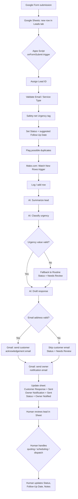

# Workflow Diagram

This diagram mirrors the exact architecture documented in
[`make-com-workflow.md`](make-com-workflow.md). It renders automatically
on GitHub.

## Scope boundary

Everything above the human review step (`O`) is automated. Everything at
and below it — actually talking to the customer, quoting a price,
scheduling a technician, dispatching a crew — is done by a person. This
system's job ends at "the customer got a fast, professional response and
the owner got notified."
